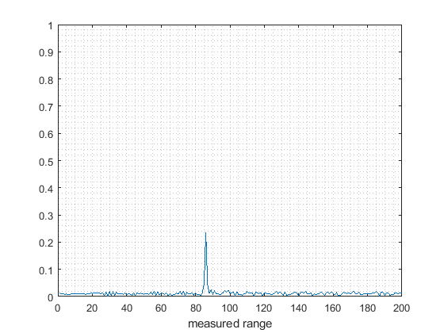
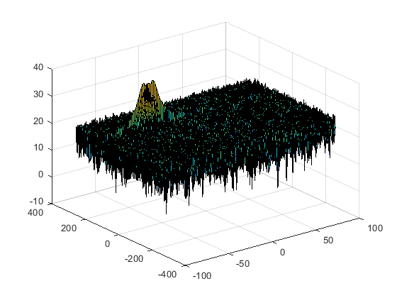

# Radar_Target_Generation_and_Detection_SFND
## Project Layout:

---
#### 1. FMCW Waveform Design
Using the given system requirements, design a FMCW waveform. Find its Bandwidth (B), chirp time (Tchirp) and slope of the chirp.

```Matlab
%% Radar Specifications 
%%%%%%%%%%%%%%%%%%%%%%%%%%%
% Frequency of operation = 77GHz
% Max Range = 200m
% Range Resolution = 1 m
% Max Velocity = 100 m/s
%%%%%%%%%%%%%%%%%%%%%%%%%%%

d_res = 1;
c = 3*10^8;
RMax = 200;

B = c/(2*d_res);  %Bandwidth
Tchirp = 5.5*2*RMax/c; %chirp time
alpha = B/Tchirp; %slope of chirps
fc= 77e9;              %carrier frequency of Radar 

```

#### 2. Simulation Loop
Simulate Target movement and calculate the beat or mixed signal for every timestamp.

```Matlab
d_0 = 85;         %define the initial_position 
v_0 = -53;        %define the initial_velocity

Nd=128;          % number of chirps
Nr=1024;         % number of samples of one chirp

t=linspace(0,Nd*Tchirp,Nr*Nd); %total time for samples

Tx=zeros(1,length(t));         %transmitted signal
Rx=zeros(1,length(t));         %received signal
Mix = zeros(1,length(t));      %beat signal

r_t=zeros(1,length(t));
td=zeros(1,length(t));

disp(length(t))
 
for i = 1:length(t)         
    r_t(i) = d0 + v0*t(i);
    td(i) = 2*r_t(i)/c; 
    Tx(i) = cos(2*pi*(fc*t(i) + slope*t(i)^2/2));
    Rx(i) = cos(2*pi*(fc*(t(i) - td(i)) + slope*(t(i) - td(i))^2/2));
    Mix(i) = Tx(i) * Rx(i);
end
```

#### 3. Range FFT (1st FFT)

Implement the Range FFT on the Beat or Mixed Signal and plot the result.

```Matlab
sig_fft = fft(Mix,Nr)./Nr;
sig_fft = abs(sig_fft);  % Take the absolute value of FFT output

% Output of FFT is double sided signal, but we are interested in only one side of the spectrum.Hence we throw out half of the samples.
sig_fft = sig_fft(1:(Nr/2));

%plotting the range
figure ('Name','Range from First FFT')

plot(sig_fft); grid minor     % plot FFT output 
axis ([0 200 0 1]);
xlabel('measured range');
```


#### 4. doppler FFT (2st FFT)

```Matlab
Mix=reshape(Mix,[Nr,Nd]);

% 2D FFT using the FFT size for both dimensions.
sig_fft2 = fft2(Mix,Nr,Nd);

% Taking just one side of signal from Range dimension.
sig_fft2 = sig_fft2(1:Nr/2,1:Nd);
sig_fft2 = fftshift (sig_fft2);
RDM = abs(sig_fft2);
RDM = 10*log10(RDM) ;

%use the surf function to plot the output of 2DFFT and to show axis in both dimensions
doppler_axis = linspace(-100,100,Nd);
range_axis = linspace(-200,200,Nr/2)*((Nr/2)/400);
figure('Name','Range Doppler Map'),surf(doppler_axis,range_axis,RDM);
```


#### 5. 2D CFAR
Implement the 2D CFAR process on the output of 2D FFT operation, i.e the Range Doppler Map.

Determine the number of Training cells for each dimension. Similarly, pick the number of guard cells.

```Matlab
T_r = 10;      %the number of Training Cells in both the dimensions.
T_d = 4;

G_r = 6;       %the number of Guard Cells in both dimensions around the 
G_d = 3;       %Cell under test (CUT) for accurate estimation
      
offset = 1.4;  % offset the threshold by SNR value in dB
```

Create a vector to store noise_level for each iteration on training cells，and  get the training Cells Num.

```Matlab
noise_level = zeros(Nr/2-2*(T_d+G_d),Nd-2*(T_r+G_r));

gridSize = (2*T_r+2*G_r+1)*(2*T_d+2*G_d+1);
trainingCellsNum = gridSize-(2*G_r+1)*(2*G_d+1);   

CFAR_sig = zeros(size(RDM));   %
```

Slide the cell under test across the complete matrix. Make sure the CUT has margin for Training and Guard cells from the edges.

```Matlab
for i = 1:(Nr/2-(2*Gr+2*Tr+1))
    for j = 1:(Nd-(2*Gd+2*Td+1))
        ...
    end
end
```

For every iteration,  convert the value from logarithmic to linear using db2pow function, then sum the signal level within all the training cells, and get the mean value. then convert it back to db using pow2db.

```Matlab
trainingCellsPatch = db2pow(RDM(i:i+2*(T_d+G_d),j:j+2*(G_r+T_r)));
trainingCellsPatch(T_d+1:end-T_d,T_r+1:end-T_r) = 0;
        
noise_level(i,j) = pow2db(sum(sum(trainingCellsPatch))/trainingCellsNum);
```

Add the offset to it to determine the threshold.

```Matlab
threshold = pow2db(sum_train/Tcell)*offset;
```

Next, compare the signal under CUT against this threshold.
If the CUT level > threshold assign it a value of 1, else equate it to 0.

```Matlab
if RDM(i+(T_d+G_d),j+(T_d+G_r))>sigThresh
    CFAR_sig(i+(T_d+G_d),j+(T_d+G_r)) = 1;
else
    CFAR_sig(i+(T_d+G_d),j+(T_d+G_r)) = 0;
end
```


